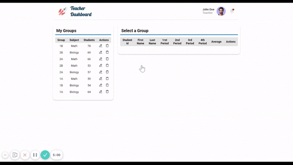
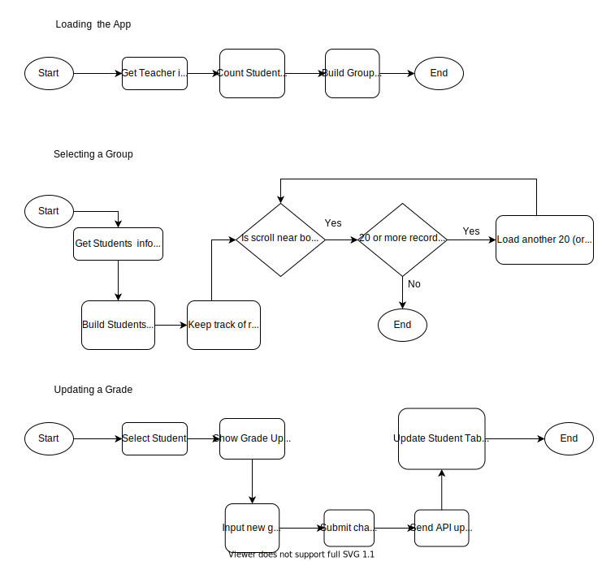

# Teacher Dashboard

Platform that allows teachers to easily manage their groups, subjects and grades


## Technologies used

Built with HTML, CSS, and Javascript

  
## Demo

This application is deployed at https://teacher-dashboard-six.vercel.app/

  
## How to Use

When you access the app, it will show the groups assigned to the current user.

- Select one of the groups.
- The student list will load on table to the right.
- 20 students will be loaded at first and more will be added to the student table as you scroll down.
- Select a student to update their grades information. Save changes and the student info will update.

  
## Screenshots




## How does it work



## Run Locally

You can clone the project and run it on your own computer. Make the changes you want.

```bash
  git clone https://github.com/iqrivas/teacher-dashboard.git
```

Go to the project directory

```bash
  cd teacher-dashboard
```

*No need to install dependencies. Just open the index.html file in your browser.